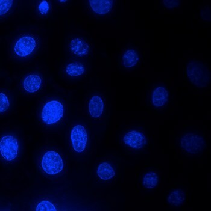

### Background Signal
When staining the objects using fluorescent dyes, some parts fo the specimen or cover glass may unwillingly be stained. This phenomenon manifests itself as barely perceptible veil covering the whole glass. 

$
I_{gt}=I_{object}+I_{background}
$

### Uneven illumination
Uneven illumination occurs when the light does not evenly illuminate your sample across the field of view. This results in darker areas and more brightly illuminated areas.

